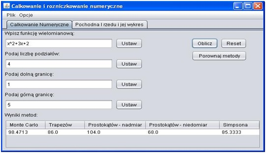
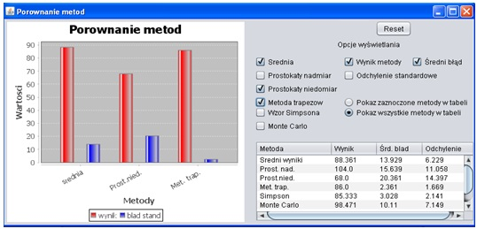
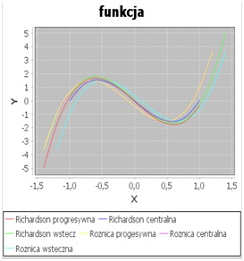
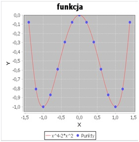
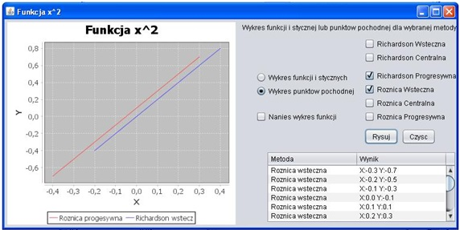
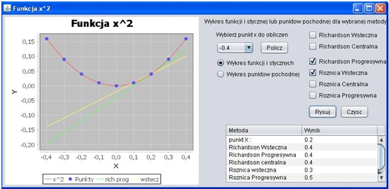

# definite-integral-calculator
Program to calculate definite integral using main methods and determing the course of the first order derivative. 

GUI is divided into 3 modules: 

1) Calculating definite integrals
2) Comparing method results 
3) Visualization of the first order derivative graph.

## Table of contents
* [Brief explanation](#explanation)
* [Methods used](#methods)
* [Definite integral and order derivative](#definite-integral)
* [Compare results of definite integral](#compare-results)
* [Visualization of derivative graph](#visualization)

##Explanation

## Methods

### Definite integral
1) Rectangle rule
2) Rectangle midpoint rule
3) Trapezoidal rule
4) Simpson rule
5) Monte Carlo

### Order derivative 
1) Backward differentiation
2) Central differentiation
3) Forward differentiation
4) All above with Richardson's extrapolation

## Definite-integral

.

.

## Compare-results

.

# Visualization

.

.

.

.

 
